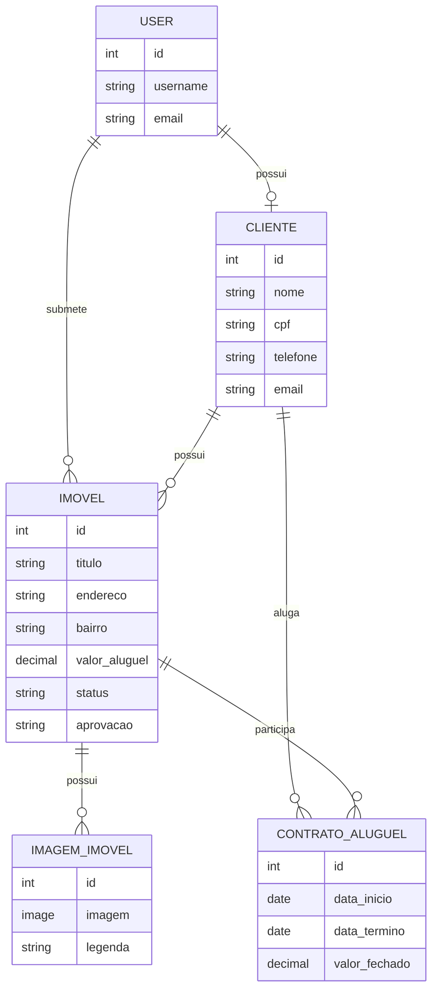

# Sistema de Gestão Imobiliária

Projeto desenvolvido para o **Trabalho Prático 1** da disciplina **GAC116 — Programação Web — 2026/1**.

O sistema implementa uma aplicação web para gestão imobiliária, com área pública para visualização de imóveis, autenticação de usuários, cadastro de clientes, anúncio de imóveis, aprovação administrativa, CRUD de entidades e painel administrativo personalizado.

## Tecnologias

| Camada | Tecnologia |
|--------|------------|
| Backend | Python 3.12 + Django 6.0.5 |
| Banco de dados | PostgreSQL 15 |
| Frontend | HTML + Bootstrap 5 + Bootstrap Icons |
| Admin | Django Unfold |
| Upload de imagens | Pillow |
| Conteinerização | Docker + Docker Compose |

## Funcionalidades

- Listagem pública de imóveis
- Página de detalhes de cada imóvel
- Filtros por busca, status e bairro
- Cadastro de usuários
- Login e logout
- Perfil de usuário
- Cadastro de cliente vinculado ao usuário logado
- Anúncio de imóvel por usuário autenticado
- Upload de múltiplas imagens para imóveis
- Aprovação ou rejeição de imóveis enviados por usuários
- CRUD de clientes para administradores
- CRUD de imóveis para administradores
- CRUD de contratos para administradores
- Ambiente administrativo personalizado com Django Unfold
- Controle de permissões entre usuários comuns e administradores
- Validação de contratos de aluguel
- Alteração automática do status do imóvel ao criar contrato

## Checkpoint 1

O Checkpoint 1 teve como foco a **modelagem do domínio** e o **ambiente administrativo**.

Requisitos atendidos:

- Projeto Django criado
- App principal criado
- Modelagem das entidades implementada
- Relacionamentos entre entidades configurados
- Migrações criadas
- Ambiente administrativo habilitado
- Admin personalizado com Django Unfold
- `list_display` configurado
- `search_fields` configurado
- `list_filter` configurado
- `inline` configurado
- Validação com `clean` implementada

## Checkpoint 2

O Checkpoint 2 expande o projeto para uma aplicação web navegável, com telas, formulários, autenticação e controle de acesso.

Funcionalidades implementadas para o Checkpoint 2:

- Interface pública para consulta de imóveis
- Templates HTML com Bootstrap
- Sistema de autenticação
- Cadastro de novos usuários
- Perfil do usuário logado
- Cadastro de cliente vinculado ao usuário
- Envio de imóveis para aprovação
- Upload de imagens no cadastro de imóveis
- Área administrativa própria, além do Django Admin
- CRUD de imóveis
- CRUD de clientes
- CRUD de contratos
- Aprovação e rejeição de imóveis por administradores
- Proteção de rotas com login obrigatório
- Proteção de rotas administrativas para usuários staff

## Modelagem

O projeto possui as seguintes entidades principais:

### Cliente

Representa uma pessoa cadastrada no sistema.

Campos principais:

- Usuário
- Nome
- CPF
- Telefone
- E-mail

Relacionamentos:

- Um cliente pode estar vinculado a um usuário do sistema.
- Um cliente pode possuir vários imóveis.
- Um cliente pode participar de vários contratos como locatário.

### Imóvel

Representa um imóvel administrado pela imobiliária.

Campos principais:

- Proprietário
- Título
- Endereço
- Bairro
- Valor do aluguel
- Status
- Aprovação
- Usuário que submeteu o imóvel

Status possíveis:

- Disponível
- Alugado
- Em manutenção

Situações de aprovação:

- Pendente
- Aprovado
- Rejeitado

Relacionamentos:

- Um imóvel pertence a um cliente.
- Um imóvel pode possuir várias imagens.
- Um imóvel pode estar vinculado a contratos de aluguel.
- Um imóvel pode ter sido submetido por um usuário do sistema.

### Imagem do Imóvel

Representa imagens associadas a um imóvel.

Campos principais:

- Imóvel
- Imagem
- Legenda

Relacionamentos:

- Cada imagem pertence a um imóvel.

### Contrato de Aluguel

Representa um contrato firmado entre um locatário e um imóvel.

Campos principais:

- Imóvel
- Locatário
- Data de início
- Data de término
- Valor fechado

Regras implementadas:

- A data de término deve ser posterior à data de início.
- Um contrato só pode ser criado para imóveis disponíveis.
- Ao criar um contrato, o status do imóvel é alterado automaticamente para `alugado`.

## Diagrama Simplificado



## Ambiente Administrativo Django

O projeto utiliza o **Django Unfold** para personalizar o painel administrativo do Django.

O admin está disponível em:

```text
/admin/
```

### ClienteAdmin

Configurações implementadas:

- `list_display`
- `search_fields`

Campos exibidos:

- Nome
- CPF
- Telefone
- E-mail

Campos pesquisáveis:

- Nome
- CPF
- E-mail

### ImovelAdmin

Configurações implementadas:

- `list_display`
- `list_filter`
- `search_fields`
- `inline`

Campos exibidos:

- Título
- Bairro
- Valor do aluguel
- Status

Filtros disponíveis:

- Status
- Bairro

Campos pesquisáveis:

- Título
- Endereço
- Bairro

Inline configurado:

- Imagens do imóvel

### ContratoAluguelAdmin

Configurações implementadas:

- `list_display`
- `list_filter`
- `search_fields`

Campos exibidos:

- Imóvel
- Locatário
- Data de início
- Data de término
- Valor fechado

Filtros disponíveis:

- Data de início
- Data de término

Campos pesquisáveis:

- Título do imóvel
- Nome do locatário
- CPF do locatário

## Rotas Principais

| Rota | Descrição | Acesso |
|------|-----------|--------|
| `/` | Página inicial com listagem de imóveis | Público |
| `/imovel/<id>/` | Detalhes do imóvel | Público |
| `/accounts/login/` | Login | Público |
| `/accounts/logout/` | Logout | Usuário logado |
| `/accounts/cadastrar/` | Cadastro de usuário | Público |
| `/perfil/` | Perfil do usuário e cadastro de cliente | Usuário logado |
| `/anunciar/` | Anunciar imóvel | Usuário logado |
| `/imoveis/pendentes/` | Imóveis aguardando aprovação | Administrador |
| `/imovel/novo/` | Cadastro de imóvel | Administrador |
| `/clientes/` | Listagem de clientes | Administrador |
| `/clientes/novo/` | Cadastro de cliente | Administrador |
| `/contratos/` | Listagem de contratos | Administrador |
| `/contratos/novo/` | Cadastro de contrato | Administrador |
| `/admin/` | Painel administrativo Django | Administrador |

## Controle de Acesso

O sistema possui dois tipos principais de acesso:

### Usuário comum

Pode:

- Criar conta
- Fazer login
- Completar o perfil como cliente
- Visualizar imóveis aprovados
- Ver detalhes dos imóveis
- Anunciar imóveis
- Acompanhar os imóveis enviados no próprio perfil

### Administrador

Pode:

- Acessar o painel Django Admin
- Cadastrar imóveis diretamente
- Editar imóveis
- Excluir imóveis
- Cadastrar clientes
- Editar clientes
- Excluir clientes
- Cadastrar contratos
- Editar contratos
- Excluir contratos
- Aprovar imóveis enviados por usuários
- Rejeitar imóveis enviados por usuários

## Validações

As principais validações estão no modelo `ContratoAluguel`.

Validações implementadas no método `clean`:

1. A data de término deve ser posterior à data de início.
2. Um novo contrato só pode ser criado para imóveis com status `disponivel`.

Além disso, o método `save` altera automaticamente o status do imóvel para `alugado` quando um novo contrato é criado.

## Estrutura do Projeto

```text
gestao-imobiliaria-django/
├── imoveis/
│   ├── admin.py
│   ├── apps.py
│   ├── context_processors.py
│   ├── forms.py
│   ├── migrations/
│   ├── models.py
│   ├── tests.py
│   └── views.py
├── media/
├── setup/
│   ├── settings.py
│   ├── urls.py
│   ├── asgi.py
│   └── wsgi.py
├── templates/
│   ├── base.html
│   ├── clientes/
│   ├── contratos/
│   ├── imoveis/
│   ├── perfil/
│   └── registration/
├── docker-compose.yml
├── Dockerfile
├── manage.py
├── requirements.txt
├── LICENSE
└── README.md
```

## Como Executar com Docker

### 1. Subir os containers

```bash
docker compose up --build
```

### 2. Aplicar as migrações

Em outro terminal, execute:

```bash
docker compose exec web python manage.py migrate
```

### 3. Criar um superusuário

```bash
docker compose exec web python manage.py createsuperuser
```

### 4. Acessar o sistema

Aplicação:

```text
http://localhost:8000/
```

Admin:

```text
http://localhost:8000/admin/
```

## Como Executar sem Docker

Para rodar sem Docker, é necessário ter PostgreSQL instalado e configurado.

Configuração padrão esperada:

| Variável | Valor padrão |
|----------|--------------|
| `DB_NAME` | `imobiliaria_db` |
| `DB_USER` | `admin` |
| `DB_PASS` | `admin` |
| `DB_HOST` | `localhost` |
| `DB_PORT` | `5432` |

### 1. Criar ambiente virtual

No Windows:

```bash
python -m venv venv
venv\Scripts\activate
```

No Linux/macOS:

```bash
python3 -m venv venv
source venv/bin/activate
```

### 2. Instalar dependências

```bash
pip install -r requirements.txt
```

### 3. Configurar o banco PostgreSQL

Crie um banco chamado:

```text
imobiliaria_db
```

Com usuário:

```text
admin
```

E senha:

```text
admin
```

Ou defina variáveis de ambiente com os dados do seu banco.

### 4. Aplicar migrações

```bash
python manage.py migrate
```

### 5. Criar superusuário

```bash
python manage.py createsuperuser
```

### 6. Rodar o servidor

```bash
python manage.py runserver
```

Acesse:

```text
http://127.0.0.1:8000/
```

## Checklist Geral

- [x] Projeto Django criado
- [x] App principal criado
- [x] Modelagem das entidades implementada
- [x] Relacionamentos entre entidades configurados
- [x] Migrações criadas
- [x] Ambiente administrativo habilitado
- [x] Admin personalizado com Django Unfold
- [x] Configuração de `list_display`
- [x] Configuração de `search_fields`
- [x] Configuração de `list_filter`
- [x] Configuração de `inline`
- [x] Validação com `clean`
- [x] Templates HTML criados
- [x] Layout com Bootstrap
- [x] Página inicial pública
- [x] Página de detalhes de imóvel
- [x] Cadastro de usuários
- [x] Login e logout
- [x] Perfil de usuário
- [x] Cadastro de cliente vinculado ao usuário
- [x] Anúncio de imóveis por usuários
- [x] Aprovação de imóveis por administrador
- [x] Rejeição de imóveis por administrador
- [x] CRUD de imóveis
- [x] CRUD de clientes
- [x] CRUD de contratos
- [x] Upload de imagens
- [x] Controle de acesso por usuário autenticado
- [x] Controle de acesso por administrador
- [x] Configuração para execução com Docker
- [x] Configuração para PostgreSQL

## Licença

Este projeto está licenciado sob os termos da licença MIT.