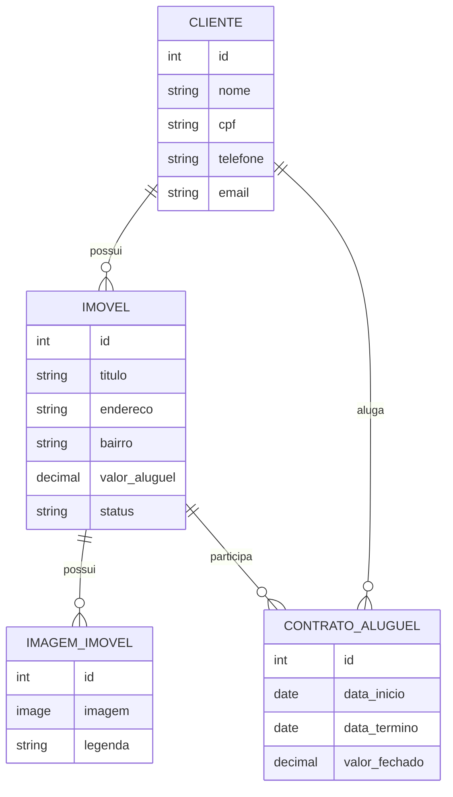

# Sistema de Gestão Imobiliária

Projeto desenvolvido para o **Trabalho Prático 1** da disciplina **GAC116 — Programação Web — 2026/1**.

O objetivo do CheckPoint 1 é entregar a **modelagem do domínio** e um **ambiente administrativo configurado**, sem utilizar o template padrão do Django Admin.

---

## Tecnologias

| Camada | Tecnologia |
|--------|-----------|
| Backend | Python 3.12 + Django 6.0.5 |
| Banco de dados | PostgreSQL 15 |
| Frontend | Bootstrap 5 + Bootstrap Icons |
| Admin | Django Unfold |
| Upload de imagens | Pillow |
| Conteinerização | Docker + Docker Compose |

---

## Funcionalidades

- Cadastro e gestão de clientes, imóveis, imagens e contratos via painel admin
- Área pública de listagem e detalhe de imóveis (filtros por busca, status e bairro)
- Upload de imagens por imóvel com legendas
- Controle de status do imóvel: disponível, alugado, em manutenção
- Validação de contratos: impede imóveis indisponíveis e datas inválidas
- Alteração automática do status do imóvel ao criar um contrato

---

## Modelagem



---

## Ambiente Administrativo

Painel personalizado com **Django Unfold**, disponível em `/admin/`.

### ClienteAdmin
- `list_display`: nome, CPF, telefone, e-mail
- `search_fields`: nome, CPF, e-mail

### ImovelAdmin
- `list_display`: título, bairro, valor do aluguel, status
- `list_filter`: status, bairro
- `search_fields`: título, endereço, bairro
- `inlines`: imagens do imóvel — permite cadastrar fotos diretamente na tela do imóvel

### ContratoAluguelAdmin
- `list_display`: imóvel, locatário, data de início, data de término, valor fechado
- `list_filter`: data de início, data de término
- `search_fields`: título do imóvel, nome do locatário, CPF do locatário

---

## Validações

Implementadas no método `clean` de `ContratoAluguel`:

1. A data de término deve ser posterior à data de início.
2. Só é possível criar um contrato para imóveis com status `disponível`.

No método `save`, ao criar um novo contrato, o status do imóvel é alterado automaticamente para `alugado`.

---

## Como Rodar

### Com Docker (recomendado)

```bash
docker-compose up --build
```

Em outro terminal:

```bash
docker-compose exec web python manage.py migrate
docker-compose exec web python manage.py createsuperuser
```

### Sem Docker

```bash
pip install -r requirements.txt
python manage.py migrate
python manage.py createsuperuser
python manage.py runserver
```

---

## Acessos

| Ambiente | URL | Credenciais |
|----------|-----|-------------|
| Admin | `/admin/` | superusuário criado via `createsuperuser` |
| Usuário | `/` | login via `/accounts/login/` |

---

## Estrutura do Projeto

```
gestao-imobiliaria-django/
├── imoveis/          # App principal (models, views, admin)
├── setup/            # Configurações do projeto Django
├── templates/        # Templates HTML (Bootstrap 5)
├── docker-compose.yml
├── Dockerfile
└── requirements.txt
```

---

## Checklist do CheckPoint 1

- [x] Projeto Django criado
- [x] App principal criado
- [x] Modelagem das entidades implementada
- [x] Relacionamentos entre entidades configurados
- [x] Migrações criadas
- [x] Ambiente administrativo habilitado
- [x] Admin personalizado com Django Unfold
- [x] `list_display` configurado
- [x] `search_fields` configurado
- [x] `list_filter` configurado
- [x] `inline` configurado
- [x] Validação com `clean` implementada
- [x] Projeto preparado para execução local
- [x] Projeto preparado para execução com Docker
