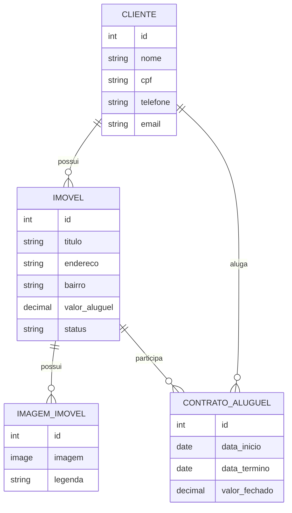

# Gestão Imobiliária Django

Projeto desenvolvido para o **Trabalho Prático 1 - Projeto Django**, da disciplina de **Programação Web**.

O objetivo do CheckPoint 1 é entregar a **modelagem do domínio** e um **ambiente administrativo configurado**, sem utilizar o template padrão do Django Admin.

Este projeto implementa um sistema administrativo para gestão de imóveis, clientes, imagens de imóveis e contratos de aluguel.

## Tema do Projeto

**Sistema de Gestão Imobiliária**

O sistema permite cadastrar clientes, imóveis disponíveis para aluguel, imagens associadas aos imóveis e contratos de aluguel firmados entre clientes e imóveis.

## Tecnologias Utilizadas

- Python 3.12
- Django 6.0.5
- Django Unfold
- Pillow
- SQLite
- Docker
- Docker Compose

## Funcionalidades Implementadas

- Cadastro de clientes
- Cadastro de imóveis
- Cadastro de imagens vinculadas a imóveis
- Cadastro de contratos de aluguel
- Validação de regras de contrato
- Alteração automática do status do imóvel ao criar contrato
- Ambiente administrativo personalizado com Django Unfold
- Configuração de `list_display`
- Configuração de `search_fields`
- Configuração de `list_filter`
- Configuração de `inline`
- Configuração de `clean` no modelo de contrato

## Modelagem

O projeto possui as seguintes entidades principais:

### Cliente

Representa uma pessoa cadastrada no sistema, podendo ser proprietária de imóveis ou locatária em contratos de aluguel.

Campos principais:

- Nome
- CPF
- Telefone
- E-mail

Relacionamentos:

- Um cliente pode possuir vários imóveis.
- Um cliente pode participar de vários contratos como locatário.

### Imóvel

Representa um imóvel administrado pela imobiliária.

Campos principais:

- Proprietário
- Título
- Endereço
- Bairro
- Valor do aluguel
- Status

Status possíveis:

- Disponível
- Alugado
- Em manutenção

Relacionamentos:

- Um imóvel pertence a um cliente.
- Um imóvel pode possuir várias imagens.
- Um imóvel pode estar vinculado a contratos de aluguel.

### Imagem do Imóvel

Representa imagens associadas a um imóvel.

Campos principais:

- Imóvel
- Imagem
- Legenda

Relacionamentos:

- Cada imagem pertence a um imóvel.

### Contrato de Aluguel

Representa um contrato firmado entre um locatário e um imóvel.

Campos principais:

- Imóvel
- Locatário
- Data de início
- Data de término
- Valor fechado

Regras implementadas:

- A data de término deve ser posterior à data de início.
- Um contrato só pode ser criado para imóveis disponíveis.
- Ao criar um contrato, o status do imóvel é alterado automaticamente para `alugado`.

## Diagrama Simplificado



## Ambiente Administrativo

O projeto utiliza o **Django Unfold** para personalizar o ambiente administrativo, atendendo ao requisito de não utilizar apenas o template padrão do Django Admin.

O painel administrativo está disponível em:

```text
http://127.0.0.1:8000/admin/
```

## Configurações do Admin

### ClienteAdmin

Configurações implementadas:

- `list_display`
- `search_fields`

Campos exibidos na listagem:

- Nome
- CPF
- Telefone
- E-mail

Campos pesquisáveis:

- Nome
- CPF
- E-mail

### ImovelAdmin

Configurações implementadas:

- `list_display`
- `list_filter`
- `search_fields`
- `inline`

Campos exibidos na listagem:

- Título
- Bairro
- Valor do aluguel
- Status

Filtros disponíveis:

- Status
- Bairro

Campos pesquisáveis:

- Título
- Endereço
- Bairro

Inline configurado:

- Imagens do imóvel

Com isso, é possível cadastrar imagens diretamente dentro da tela de cadastro/edição de um imóvel.

### ContratoAluguelAdmin

Configurações implementadas:

- `list_display`
- `list_filter`
- `search_fields`

Campos exibidos na listagem:

- Imóvel
- Locatário
- Data de início
- Data de término
- Valor fechado

Filtros disponíveis:

- Data de início
- Data de término

Campos pesquisáveis:

- Título do imóvel
- Nome do locatário
- CPF do locatário

## Validações Implementadas

A entidade `ContratoAluguel` possui validações no método `clean`.

Validações:

1. A data de término do contrato deve ser posterior à data de início.
2. Um novo contrato só pode ser criado se o imóvel estiver com status `disponível`.

Além disso, o método `save` altera automaticamente o status do imóvel para `alugado` quando um novo contrato é criado.

## Estrutura do Projeto

```text
gestao-imobiliaria-django/
├── imoveis/
│   ├── admin.py
│   ├── apps.py
│   ├── migrations/
│   ├── models.py
│   ├── tests.py
│   └── views.py
├── setup/
│   ├── settings.py
│   ├── urls.py
│   ├── asgi.py
│   └── wsgi.py
├── docker-compose.yml
├── Dockerfile
├── manage.py
├── requirements.txt
├── LICENSE
└── README.md
```

## Como Executar o Projeto Localmente

### 1. Clonar o repositório

```bash
git clone https://github.com/joaogsribeiro/gestao-imobiliaria-django.git
cd gestao-imobiliaria-django
```

### 2. Criar o ambiente virtual

No Windows:

```bash
python -m venv venv
venv\Scripts\activate
```

No Linux/macOS:

```bash
python3 -m venv venv
source venv/bin/activate
```

### 3. Instalar as dependências

```bash
pip install -r requirements.txt
```

### 4. Aplicar as migrações

```bash
python manage.py migrate
```

### 5. Criar um superusuário

```bash
python manage.py createsuperuser
```

### 6. Executar o servidor

```bash
python manage.py runserver
```

Acesse o sistema em:

```text
http://127.0.0.1:8000/admin/
```

## Como Executar com Docker

O projeto também possui arquivos de configuração para execução com Docker.

### 1. Construir e subir os containers

```bash
docker compose up --build
```

### 2. Aplicar as migrações dentro do container

Em outro terminal, execute:

```bash
docker compose exec web python manage.py migrate
```

### 3. Criar o superusuário

```bash
docker compose exec web python manage.py createsuperuser
```

### 4. Acessar o admin

```text
http://127.0.0.1:8000/admin/
```

## Checklist do CheckPoint 1

- [x] Projeto Django criado
- [x] App principal criado
- [x] Modelagem das entidades implementada
- [x] Relacionamentos entre entidades configurados
- [x] Migrações criadas
- [x] Ambiente administrativo habilitado
- [x] Admin personalizado com Django Unfold
- [x] `list_display` configurado
- [x] `search_fields` configurado
- [x] `list_filter` configurado
- [x] `inline` configurado
- [x] Validação com `clean` configurada
- [x] Projeto preparado para execução local
- [x] Projeto preparado para execução com Docker

## Licença

Este projeto está licenciado sob os termos da licença MIT.